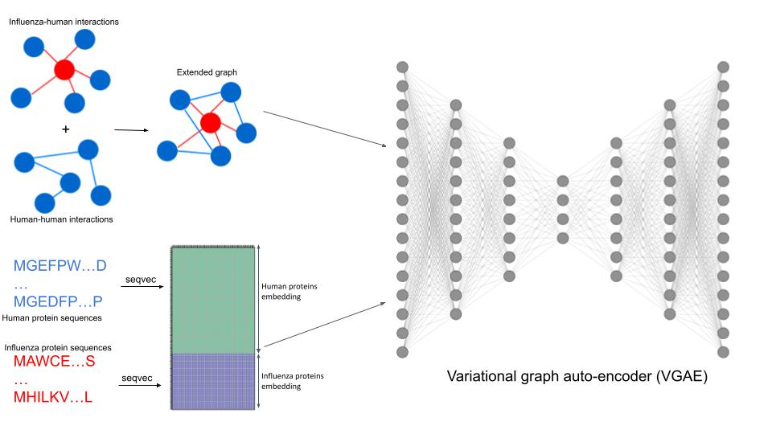
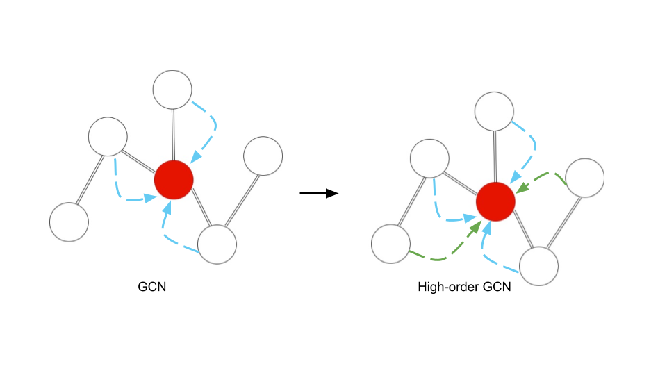

# HO-VGAE_ppi_predictor

## Hypothesis: 
Influenza viral proteins will target human proteins that have unique sequence features and topological features in the human interactome networks. This graph variational auto-encoder is thus designed to learn the topological features of the human proteins as well as sequence features of human proteins.


## Datasets:
Construct the full dataset by concatenating STRING physical interaction networks between human proteins.
Influenza interactions are retrieved from STRING viruses using Influenza A virus and added on top of the STRING human-human interaction network. 

All the influenza and host sequences were then embedded using [SeqVec](https://github.com/mheinzinger/SeqVec) and each seqeunce became a vector of 1024.

## Training and learning objectives:
First, randomly remove 20% of edges from the adjacency matrix and split these 20% of edegs into test set validation set. Then the rest of edges, together with the sequence embedded features,is 
taken up by the variational graph auto-encoder (VGAE). The learning task is to reconstruct the masked 20% edges by learning the topological and sequence features of the nodes of the remaining 80% of edges.

## GCN VS High-order GCN
A typical GCN layer will convolute information from the node's one-hop neighbour but in this project, I used high-oder GCN (HO-GCN), which can take convolute the information from 2nd or even further neighbours. 
HO-GCN achieves this by performing random walks at each GCN layer before passing on the information to the next layer. Thus, naturally, HO-GCN introduced **2** new hyper-perameters: the number of random walks and 
the possibility of restart at each random walk. 


## Run the code from docker
The docker image can be obtained
```bash
docker pull ghcr.io/dingquanyu/ho-vgae_ppi_predictor:latest
```
Then docker run automatically starts the training:
```bash
docker run --rm -it ghcr.io/dingquanyu/ho-vgae_ppi_predictor:latest
```
The entrypoint by default was set to be:
```bash
python /app/ho-vgae_ppi_predictor/train.py \
    --path_to_graph=/input_data/influenza_human_PPN_clean.gml \
    --path_to_node_features=/input_data/feature_mtx.pkl \
    --model=HOVGAE --alpha=0.2
```
The only hyper-perameter is ```alpha``` and the user is free to overwrite the entrypoint and use different settings of ```alpha```
The user can choose either "HOVGAE" or "VGAE" as ```--model``` to see how high-order GCN could make a difference. 

## Mathmetical approximation 
Since the number of random walks at each convultion layer, it is very time and computationally consuming to determine the best number of random walk. Thus, below is the 
approximation of infinte steps of random walk at each layer.

At **$l^{th}$** layer, $k^{th}$ random walk equals to: 
$$H_k^l=(1-\alpha)A_{norm}H_{k-1}^l + \alpha H_0^l \ (1)$$
Where $\alpha\in\(0,1]$ is the possibilty of restart, $A_{norm}\in N\times N$ is the normalised adjacency matrix, obtained by:
$$A_{norm}=D^{-\frac{1}{2}}AD^{-\frac{1}{2}} \ (2)$$ where $D\in N\times N$ is the degree matrix and $A\in N\times N$ is the adjacency matrix.

And since random walk converges to a Wiener process, if the number of walks is infinite, then $H_k^l$ is approximately equal to $H_{k-1}^l$ Subtitute 
$H_k^l$ with $H_{k-1}^l$ in Equation 1 and it became:
$$H_k^l=(1-\alpha)A_{norm}H_{k}^l + \alpha H_0^l \ (3)$$
$$H_k^l=\alpha(1-(1-\alpha)A_{norm})^{-1}H_0^l \ (4)$$
where $H_0^0 \in R^{N \times 1024}$ is the input sequence feature matrix.
Since $\alpha(1-(1-\alpha)A_{norm})^{-1}$ is used in every step, I calculated it beforehands and name it as matrix $Y$
Thus output of $l^{th}$ HO-GCN layer is defined as:
$$H^l = GCN(YH^{l-1}W) \ \ l\ge1 \ (5)$$ where $W$ is the trainable weight and $H^0\in R^{N \times 1024}$ is the input 
